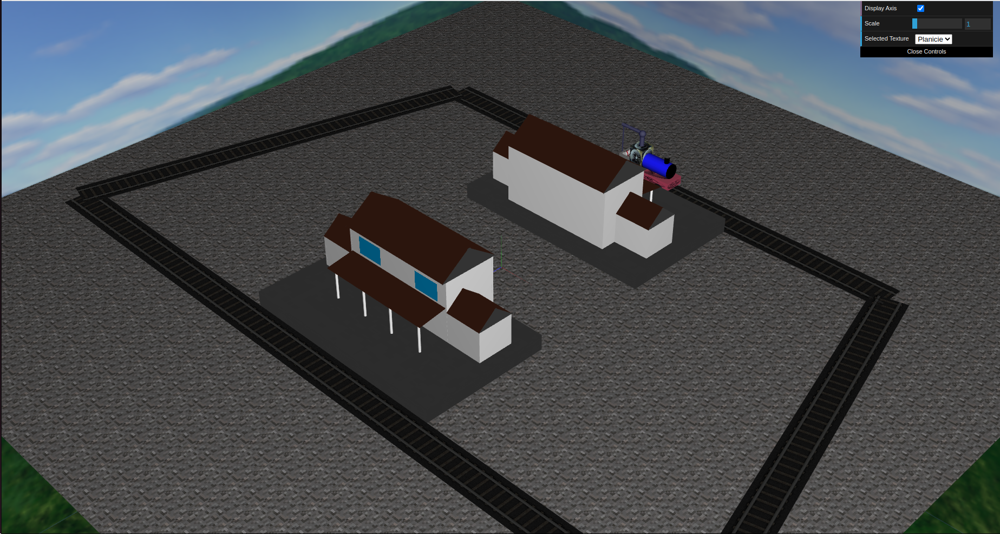

# CGRA 2021/2022

Code developed in Computer Graphics FEUP curricular unit.

  - [tp1](tp1/README.md)
  - [tp2](tp2/README.md)
  - [tp3](tp3/README.md)
  - [tp4](tp4/README.md)
  - [tp5](tp5/README.md)
  - [Project](project/README.md)

  

## Project [📂](project/)

This project consists on a train, inspired by the real train "Thomas the Pain Train", that goes around on the tracks and stops on stations.
The project is still missing some parts...