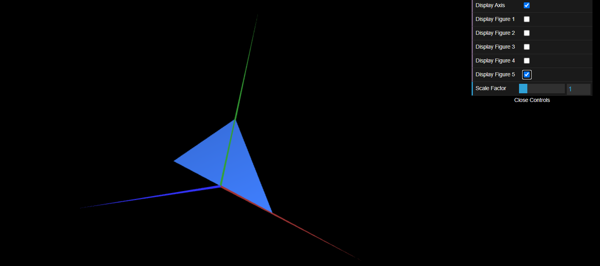
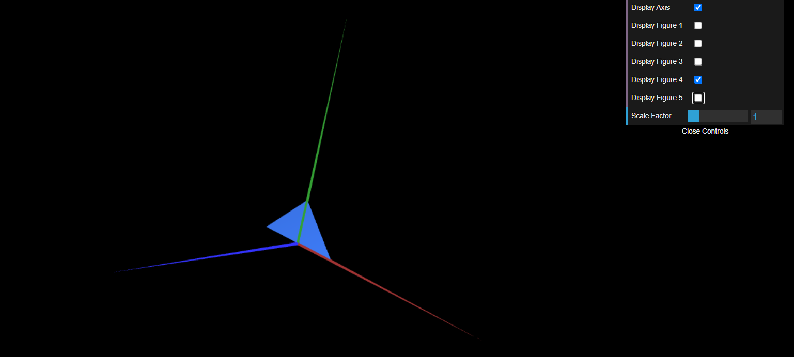

# CGRA 2021/2022

## Group T10G08

## TP 1 Notes

- No exercicio 1, fomos capazes de criar as subclasses MyTriangle e MyParallelogram a partir da MyDiamond dada, bem como criar a sua checkbox, sem dificuldade.

- No exercicio 2, conseguimos, a partir da subclass MyTriangle criar MyTriangleSmall e MyTriangleBig.

