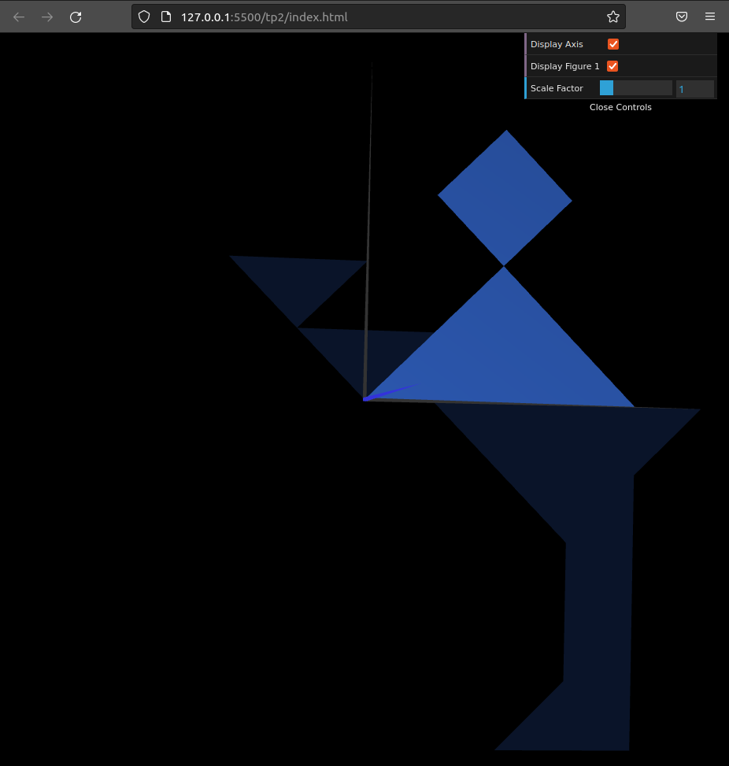
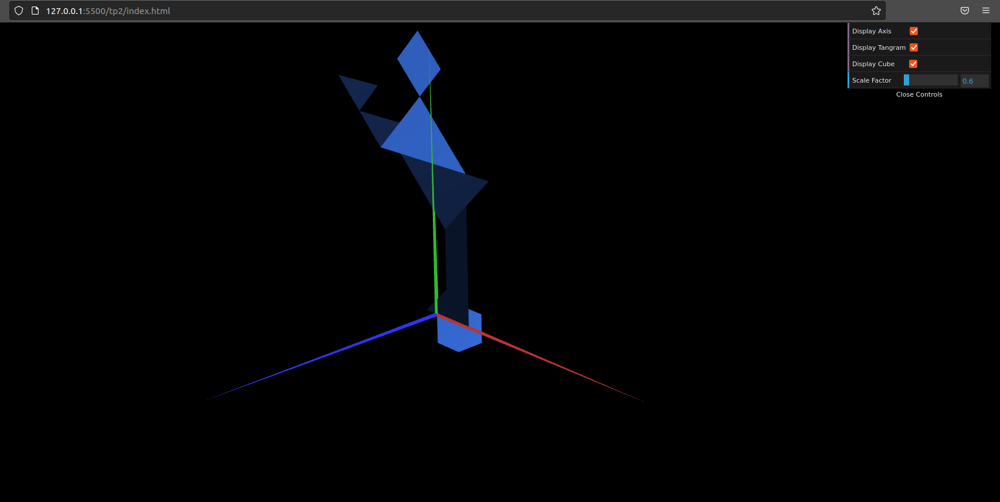
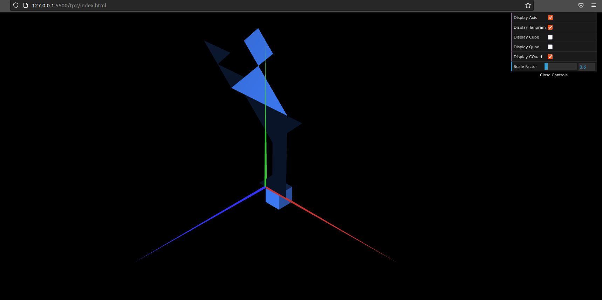

# CGRA 2021/2022

## Group T10G08

## TP 2 Notes

- No exercicio, fomos capazes de construir a figura pedida através de translações e rotações das várias peças anteriormente criadas.

- Fomos capazes de criar um cubo unitário dentro das medidas pedidas, os 8 vertices foram identificados, bem como as faces. Por fim o cubo foi colocado como uma base do tangram criado anteriormente, e foi posicionado com o vertice superior esquerdo na origem.

- Após criar MyQuad, conseguimos cirar um cubo em MyUnitCubeQuad a partir do quadrado criado em MyQuad. Por fim colocamos o novo quadrado criado na base do tangram e com o vertice superior esquerdo na origem.

