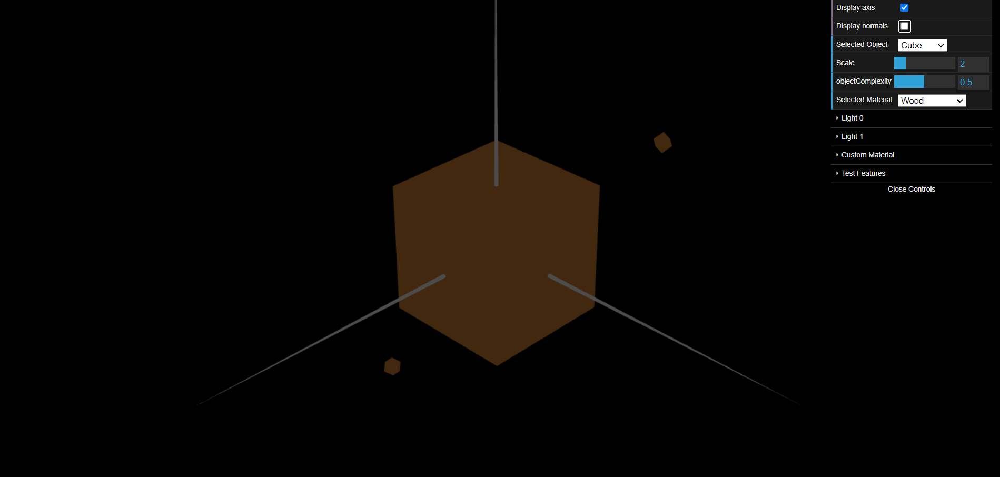
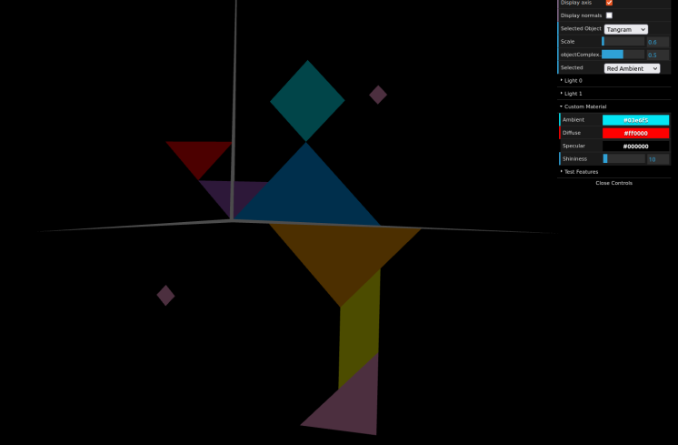

# CGRA 2021/2022

## Group T10G08

## TP 3 Notes

- No exercicio, fomos capazes de aplicar o novo material Wood ao cubo após criar este na classe MyScene e adicioná-lo ao menu de drop down com todos os materiais.

- Fomos capazes de aplicar o material Costum  figura da classe MyDiamond.

